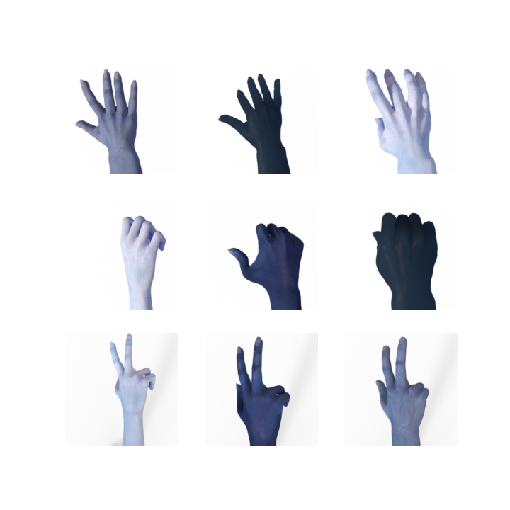

# Rock_Scissors_Paper_Gmae

## Gaol and Purpose

The goal of my capstone project to develop a rock-scissors-paper game using a Convolutional Neural Network (CNN) is to implement a machine learning model that
can recognize and predict the outcome of a rock-scissors-paper game. The purpose of this project is to demonstrate the capability of a CNN in recognizing and
classifying images, in this case, images of hand gestures representing rock, scissors, or paper.

The game will work by allowing a player to make a hand gesture, which will then be captured by a camera or a webcam. The image will be processed and passed 
through the CNN model, which will predict the hand gesture and determine the outcome of the game based on the rules of rock-scissors-paper. The project will 
showcase the application of CNNs in computer vision and image classification tasks, and the ability of a machine learning model to make predictions based on 
input data.

In conclusion, the goal of my capstone project is to develop a functional rock-scissors-paper game using a CNN and the purpose is to demonstrate the application of CNNs in image classification and the ability of a machine learning model to make predictions.

## Dataset and EDA

#### First dataset:
[Resource](https://laurencemoroney.com/datasets.html#rock-paper-scissors-dataset)

This dataset contains a total of 2892 images.
 - Train set: 2520 images (840 in each class)
 - Test set: 372 images (214 in each class)
 - Validation set: 33 images
All images are RGB images of 300 pixels wide by 300 pixels high in .png format. The images are separated in three sub-folders named 'rock', 'paper' and 'scissors'
according to their respective class.

 

#### Second dataset:
[Resource](https://www.kaggle.com/datasets/drgfreeman/rockpaperscissors)

The dataset contains a total of 2188 images corresponding to the 'Rock' (726 images), 'Paper' (710 images) and 'Scissors' (752 images) hand gestures of the
Rock-Paper-Scissors game. All image are taken on a green background with relatively consistent ligithing and white balance.
All images are RGB images of 300 pixels wide by 200 pixels high in .png format. The images are separated in three sub-folders named 'rock', 'paper' and 'scissors'
according to their respective class.

#### Third and final dataset:
[Resource to gather your own images as dataset](https://github.com/CircuitDigest/Rock-Paper-Scissors-with-Pi)

My web app will be capture the image from the webcam as the input to my model's prediciton.  It will be better to train my model with the real images captured by
a webcam.  Therefore, I have created a total of 17550 images captured by a webcam as my final dataset.
All images are RGB images of 252 pixels wide by 188 pixels high in .jpg format. The images are separated in three sub-folders named 'rock', 'paper' and 'scissors'
according to their respective class.
 - Train set: 13500 images (4500 in each class)
 - Test set: 4350 images (1450 in each class)
 - 

In order to get a better result for the model and prediction, I have trained the model with color-inverted images and will also invert color for the new images
for prediction. 

This the input image captured from the web app

## Models

### CNN: Convolutional Neural Network

#### Baseline model

### Best Model

## Web App Deployment using Gradio

[Resource](https://gradio.app/)

(Host it on Streamlit or Hugging Face!!)

## Limitations and Next Steps
The Rock-Scissors-Paper game using a Convolutional Neural Network (CNN) is a good example of image classification using deep learning. However, there are some
limitations to this approach that should be addressed in future work.
1. Limited training data: The performance of the CNN is highly dependent on the amount of training data. In most cases, the model is trained on a small dataset, 
which can limit its generalization capabilities and make it prone to overfitting.
2. Poor hand posture: In some cases, the hand posture of the player may not be ideal, which can negatively impact the performance of the CNN. This can be addressed
by using data augmentation techniques to increase the amount of training data and make the model more robust to different hand postures.
3. Background noise: The presence of background noise or distracting objects can also negatively impact the performance of the CNN. This can be addressed by using
pre-processing techniques such as image segmentation or object detection to isolate the hand from the background.
4. Limited to 3 classes: The current implementation of the CNN is limited to recognizing only three classes, which are rock, scissors, and paper. However, this can
be easily extended to recognize other gestures or classes.

Next steps for improving the Rock-Scissors-Paper game using a CNN could include:
1. Increasing the size of the training dataset to improve the generalization capabilities of the model.
2. Using transfer learning techniques to fine-tune pre-trained models on similar tasks, which can save time and resources compared to training a model from scratch.
3. Implementing post-processing techniques to improve the performance of the model, such as non-maximum suppression to remove redundant detections.
4. Extending the model to recognize additional classes or gestures beyond rock, scissors, and paper.

## Applied and Conclusion

Yes, the rock-scissors-paper game using a Convolutional Neural Network (CNN) can be applied to solve a real-world problem such as sign language translation. 
Sign language is used by millions of people around the world who are deaf or hard of hearing, but not everyone knows sign language. In such cases, sign language
interpretation can be a real challenge.

A CNN can be trained on a large dataset of hand gestures representing different words in sign language. The trained model can then be used to recognize and 
translate sign language gestures in real-time, making communication between hearing and non-hearing individuals smoother and more accessible. The system can 
be integrated into various devices such as smartphones, smartwatches, or even smart glasses, allowing for seamless sign language translation on-the-go.

In conclusion, the application of a rock-scissors-paper game using a CNN to solve the problem of sign language translation can have a significant impact on the 
lives of individuals who use sign language, making communication more accessible and bridging the gap between hearing and non-hearing individuals.

